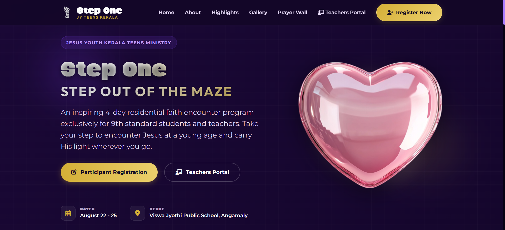
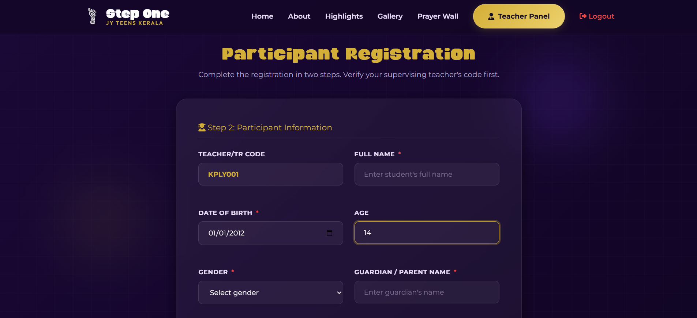
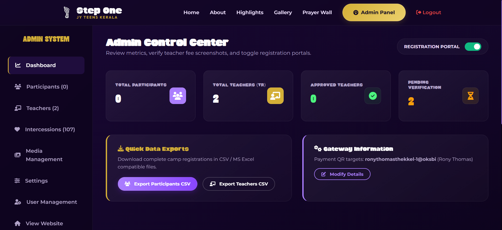
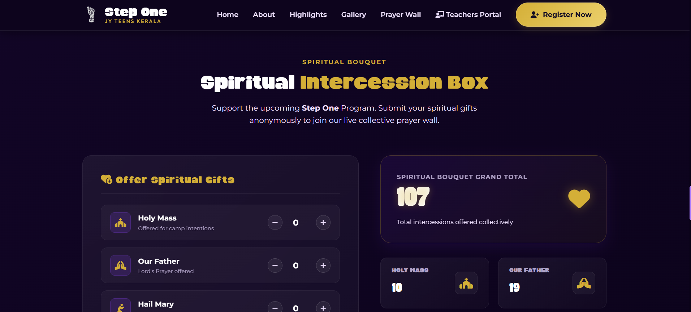

# 🚀 StepOne – Event Registration & Management Portal

A production-ready event registration and management portal developed for the **Jesus Youth Kerala Teens Ministry** to streamline participant registration and event administration.

The application enables participants to register online while providing administrators with a centralized dashboard to manage registrations efficiently. Designed with a mobile-first approach, the portal ensures a seamless user experience across devices.

🌐 **Live Website:** https://stepone.jyteenskerala.org

---

## 📖 Overview

StepOne is a full-stack web application built to simplify the registration process for large-scale youth events. The system replaces manual registration workflows with an efficient digital platform, allowing organizers to manage participant information securely and effectively.

The application was developed using **PHP, MySQL, HTML5, CSS3, and JavaScript** and deployed for real-world use.

---

## ✨ Features

### 👥 Participant Registration
- Online registration with validation
- Responsive registration forms
- Secure data submission
- User-friendly interface

### 🔐 Authentication
- Secure login system
- Session management
- Role-based access

### 📊 Admin Dashboard
- Manage participant registrations
- View registration details
- Update participant information
- Monitor event data efficiently

### 📱 Responsive Design
- Mobile-first design
- Optimized for smartphones, tablets, and desktops
- Cross-browser compatibility

---

## 🛠 Tech Stack

### Frontend
- HTML5
- CSS3
- JavaScript

### Backend
- PHP

### Database
- MySQL

### Tools
- Git
- GitHub
- XAMPP
- phpMyAdmin

---

## 📂 Project Structure

```text
StepOne/
│
├── admin/
├── assets/
├── css/
├── images/
├── includes/
├── js/
├── uploads/
├── index.php
├── login.php
├── register.php
└── ...
```

---

## 📸 Screenshots

> Add screenshots inside a `screenshots` folder and replace the image paths below.

### Home Page



### Registration Page



### Admin Dashboard



### Intercession Section



### Participant Login


---

## 🚀 Getting Started

### Clone the repository

```bash
git clone https://github.com/Codewith-Rony/stepone-event-registration-portal.git
```

### Navigate to the project

```bash
cd stepone-event-registration-portal
```

### Configure Database

1. Create a MySQL database.
2. Import the SQL file.
3. Update your database configuration file with your local credentials.

### Run the project

Place the project inside your web server directory (e.g., XAMPP `htdocs`) and start Apache and MySQL.

---

## 🌍 Live Demo

🔗 https://stepone.jyteenskerala.org

---

## 🔒 Security Notice

This repository is a portfolio version of the project.

Sensitive information such as production database credentials, configuration files, API keys, uploaded user data, and other confidential information has been removed before publishing.

---

## 📈 Future Enhancements

- Email notifications
- QR code-based event check-in
- Payment gateway integration
- Analytics dashboard
- Multi-event support
- Export registrations to Excel/PDF

---

## 👨‍💻 Author

**Rony Thomas**

Software Engineer | Full Stack Developer

🌐 Portfolio: https://codewith-rony.github.io

💼 LinkedIn: https://linkedin.com/in/rony-thomas3

🐙 GitHub: https://github.com/Codewith-Rony

---

## ⭐ Support

If you found this project interesting, consider giving it a ⭐ on GitHub.
